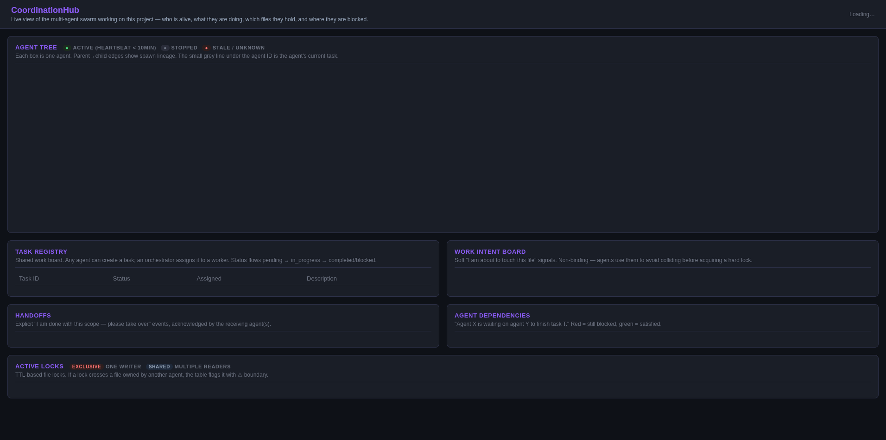

# CoordinationHub

**Stop AI coding assistants from overwriting each other's work.**

When you let multiple AI assistants help on the same project, they can accidentally undo each other's edits — one rewrites a file while another is still working on it. CoordinationHub is a shared notice-board that tracks who's editing what, and stops two assistants from touching the same file at once. Live dashboard included.

Runs locally on your machine. No Docker, no external services, no API keys to manage.

*For developers:* small MCP server, pure Python stdlib, zero third-party dependencies. Works with Claude Code's hooks out of the box; compatible with any MCP client.



*The web dashboard at `http://127.0.0.1:9898` (above) shows the agent tree, task registry, work intent board, handoffs, dependencies, and active locks live — fed by the same SQLite store the hooks write to. Drag to pan, mouse-wheel to zoom.*

---

## Why you might want this

When three AI coding assistants help refactor the same part of your project, they'll sometimes step on each other — two of them editing the same file at once, whichever saves last wins, no warning that anything was lost. CoordinationHub is the shared whiteboard they all check before touching anything: one place that shows *who's alive*, *who holds which file*, *which tasks are blocked*, and *where one assistant's edits are crossing into another's territory*.

## Install

```bash
pip install coordinationhub
```

## 60-second quick start

```bash
# One-time setup: creates the SQLite store and wires Claude Code hooks
coordinationhub init

# Optional opt-ins (recommended for multi-agent work):
coordinationhub init --auto-dashboard --monitor-skill
#   --auto-dashboard  installs a SessionStart hook that idempotently launches
#                     the dashboard at http://127.0.0.1:9898 every session.
#   --monitor-skill   installs a `coordinationhub-monitor` skill at
#                     ~/.claude/skills/ — invoke it on a Claude Code agent
#                     and that agent becomes a read-only swarm watcher
#                     (polls the dashboard, surfaces boundary crossings,
#                     blocked tasks, and stale agents).

# Sanity-check the install
coordinationhub doctor
```

That's it. From the next Claude Code session in this repo, every agent self-registers, every Write/Edit acquires a lock, every subagent shows up in the dashboard tree, and on session-end everything is cleaned up. You don't need to call any MCP tool by hand.

## Watch the swarm

```bash
coordinationhub serve-sse        # web dashboard (auto-started by --auto-dashboard above)
coordinationhub watch            # live-refreshing terminal tree
coordinationhub agent-tree       # one-shot terminal tree
coordinationhub status           # JSON snapshot
```

The dashboard panel layout (matching the screenshot above):

| Panel | What it shows |
|-------|----------------|
| **Agent Tree** | Hierarchy with parent→child edges, current task per agent, lock count, status dot. Pan + zoom controls in the corner. |
| **Task Registry** | Shared work board: pending / in_progress / completed / blocked, with the assigned agent and description. |
| **Work Intent Board** | Soft "I am about to touch this file" markers — TTL'd, non-binding, used to avoid colliding before acquiring a hard lock. |
| **Handoffs** | Explicit "I'm done with this scope, you take it" events with acknowledgements. |
| **Agent Dependencies** | "Agent X is waiting on agent Y to finish task T" — green when satisfied, red while still blocking. |
| **Active Locks** | Every TTL'd file lock with age, time-to-live, lock type, and a ⚠ marker when the lock crosses into another agent's owned territory. |

## Agent tree at a glance

Every agent in the swarm sees the same hierarchy. From the terminal:

```
hub.cc.main [active] — "observing..."
├── hub.cc.main.0 [Agent A] — service consolidation
│   ├─ ◆ src/services/mcpProbes.js [exclusive]
│   └─ ◆ mcpChallengeRoutes.js [exclusive] ⚠ owned by hub.cc.main.1
├── hub.cc.main.1 [Agent B] — "route simplification"
│   ├─ ◆ routeLoader.js [exclusive L325-360]
│   └─ ◆ vcsRoutes.js [exclusive]
└── hub.cc.main.2 [Agent C] — data layer
    ├── hub.cc.main.2.0 [CA] — "working on fileStore.js"
    │   └─ ◆ fileStore.js [exclusive]
    └── hub.cc.main.2.1 [CB] — "working on BaseModel"
        ├─ ◆ BaseModel.js [exclusive]
        └─ ◆ baseModel.test.js [shared]
```

Each node shows: agent ID, role/task, every active file lock with type and region, plus a ⚠ when the lock crosses someone else's owned territory.

## What it does, in one screen

- **File locking** with TTL, retry, and force-steal-with-conflict-log.
- **Region locking** — two agents can edit non-overlapping ranges of the same file.
- **Scope enforcement** — agents declare a path-prefix scope; out-of-scope locks are denied.
- **Boundary detection** — flags any lock that crosses into another agent's owned territory.
- **Cascade cleanup** — when an agent dies, children are re-parented to the grandparent and locks released. Nothing is orphaned.
- **Agent tracking** — globally unique IDs (`hub.PID.seq.seq`), live hierarchy, heartbeat-based stale detection.
- **Change notifications** — agents publish what they changed, others poll. No message bus.
- **Inter-agent messaging** — direct point-to-point with arbitrary JSON payloads.
- **Cross-agent dependencies** — auto-satisfy when the depended-on task completes.
- **Contention hotspots** — rank files by lock-conflict frequency.
- **Dashboard** — pure-SVG live view, zero JS dependencies, fed by SSE.

---

## Optional: coordination graph

Define your agent roles and handoff rules once in a `coordination_spec.yaml` at the repo root, and `scan_project` / `run_assessment` use it to attribute file ownership and score swarm behaviour.

```yaml
agents:
  - id: planner
    role: decompose tasks
    responsibilities: [break down user stories, assign subtasks]
  - id: executor
    role: implement
    responsibilities: [write code, run tests]

handoffs:
  - from: planner
    to: executor
    condition: task_size < 500 && no_blockers
```

Fine without one — `scan_project` and `run_assessment` synthesise an implicit graph from live agent registrations when no spec exists.

---

## Reference

### Agent ID format

```
hub.12345.0           — root agent (namespace.PID.sequence)
hub.12345.0.0         — child of root
hub.12345.0.1         — sibling
hub.12345.0.0.0       — grandchild
```

### MCP tools (<!-- GEN:tool-count -->50<!-- /GEN -->)

Several entries are meta-tools that dispatch on an `action` parameter (`manage_messages`, `manage_dependencies`, `manage_work_intents`, `manage_leases`, `admin_locks`, `query_tasks`, `task_failures`) — keeps the surface small (target ≤ 50 enforced by `tests/test_tool_count.py`). Full auto-generated table with descriptions is in [`COMPLETE_PROJECT_DOCUMENTATION.md`](COMPLETE_PROJECT_DOCUMENTATION.md#mcp-tools).

| Category | Tools |
|----------|-------|
| **Identity** | `register_agent`, `heartbeat`, `deregister_agent`, `list_agents`, `get_agent_relations` |
| **Locking** | `acquire_lock`, `release_lock`, `refresh_lock`, `get_lock_status`, `list_locks`, `admin_locks` |
| **Coordination** | `broadcast`, `wait_for_locks`, `await_agent` |
| **Broadcast** | `acknowledge_broadcast`, `wait_for_broadcast_acks` |
| **Messaging** | `send_message`, `manage_messages` |
| **Changes** | `notify_change`, `get_notifications` |
| **Audit** | `get_conflicts`, `get_contention_hotspots`, `status` |
| **Visibility** | `load_coordination_spec`, `scan_project`, `get_agent_status`, `get_file_agent_map`, `update_agent_status`, `run_assessment`, `get_agent_tree` |
| **Tasks** | `create_task`, `create_subtask`, `assign_task`, `update_task_status`, `query_tasks`, `wait_for_task`, `get_available_tasks`, `task_failures` |
| **Dependencies** | `manage_dependencies` |
| **Work Intent** | `manage_work_intents` |
| **Handoffs** | `wait_for_handoff` |
| **HA Leases** | `acquire_coordinator_lease`, `manage_leases` |
| **Spawner** | `spawn_subagent`, `report_subagent_spawned`, `get_pending_spawns`, `request_subagent_deregistration`, `await_subagent_registration`, `await_subagent_stopped`, `is_subagent_stop_requested` |

### CLI commands (<!-- GEN:cli-count -->75<!-- /GEN -->)

```bash
# Setup & diagnostics
coordinationhub init [--auto-dashboard] [--monitor-skill]   # one-time setup; opt-in extras
coordinationhub doctor                                       # validate setup, detect venv issues
coordinationhub auto-start-dashboard                         # idempotent dashboard launcher (used by hook)

# Servers
coordinationhub serve --port 9877                            # HTTP MCP server
coordinationhub serve-mcp                                    # stdio MCP (requires coordinationhub[mcp])
coordinationhub serve-sse --port 9898                        # web dashboard with SSE stream

# See what's happening
coordinationhub status                                       # JSON snapshot
coordinationhub dashboard                                    # full terminal table
coordinationhub agent-tree                                   # hierarchy
coordinationhub agent-status <id>                            # single agent detail
coordinationhub contention-hotspots                          # files with most conflicts
coordinationhub watch                                        # live-refresh tree (Ctrl+C)

# Agent lifecycle
coordinationhub register <id> [--parent-id <parent>]
coordinationhub heartbeat <id>
coordinationhub deregister <id>
coordinationhub list-agents
coordinationhub agent-relations <id> [--mode lineage|siblings]

# File locking
coordinationhub acquire-lock <path> <id> [--region-start N --region-end N]
coordinationhub release-lock <path> <id>
coordinationhub refresh-lock <path> <id>
coordinationhub lock-status <path>
coordinationhub list-locks [--agent-id <id>]
coordinationhub admin-locks <action>                         # release_agent_locks | reap_expired | reap_stale_agents

# Coordination & changes
coordinationhub broadcast <id> [--document-path <path>]
coordinationhub wait-for-locks <id> <paths...>
coordinationhub notify-change <path> <type> <id>
coordinationhub get-notifications
coordinationhub wait-for-notifications <id> [--timeout S] [--exclude-agent <agent>]
coordinationhub get-conflicts

# Graph & assessment
coordinationhub load-spec
coordinationhub validate-spec
coordinationhub scan-project
coordinationhub assess [--suite <file>]                      # without --suite scores live session

# Tasks
coordinationhub create-task <task_id> <parent_agent_id> <description>
coordinationhub assign-task <task_id> <agent_id>
coordinationhub update-task-status <task_id> <status>
coordinationhub query-tasks <action>                         # by_id | by_parent | by_assigned | tree
coordinationhub wait-for-task <task_id> [--timeout S]
coordinationhub get-available-tasks [--agent-id <id>]
coordinationhub task-failures <action>                       # retry | dlq | history
```

Run `coordinationhub --help` for the full list (74+ commands; HA leases, spawner, work intents, dependencies, handoffs).

### Architecture

SQLite-backed, thread-safe, WAL mode. Every module under 500 code LOC with single responsibility. Sub-modules have zero internal cross-dependencies — they receive a `connect` callable from the caller. Both HTTP and stdio servers share `dispatch.py` and the `schemas/` package.

Engineering notes (design decisions, schema versioning, hook contract, sub-agent task correlation, file ownership rules) live in [`CLAUDE.md`](CLAUDE.md). Auto-generated file inventory and full MCP tool table live in [`COMPLETE_PROJECT_DOCUMENTATION.md`](COMPLETE_PROJECT_DOCUMENTATION.md). Reverse-chronological dev log is in [`LLM_Development.md`](LLM_Development.md).

```
coordinationhub/
  core.py + core_*.py mixins  — CoordinationEngine, one mixin per capability
  _storage.py                 — SQLite pool, path resolution, thread-safe ID generation
  db.py + db_schemas.py + db_migrations.py
                              — connection pool, schema definitions, migration driver
  lock_ops.py                 — lock primitives + region-overlap detection
  agent_registry.py           — agent lifecycle (register/heartbeat/deregister/lineage)
  notifications.py            — change notification storage
  conflict_log.py             — conflict recording + queries
  scan.py / agent_status.py   — file ownership scan, agent tree
  schemas/                    — 14 per-domain MCP tool schema modules
  dispatch.py                 — tool dispatch table
  mcp_server.py               — HTTP server (stdlib http.server only)
  mcp_stdio.py                — stdio MCP server (optional `mcp` package)
  cli.py + cli_*.py           — argparse parser + per-domain command handlers
  hooks/{base,claude_code,kimi_cli,cursor}.py
                              — IDE hook adapters
  plugins/{assessment,dashboard,graph}/
                              — assessment runner, web dashboard, coordination graph
  data/monitor_skill.md       — installable Claude Code skill template
  tests/                      — <!-- GEN:test-count -->602<!-- /GEN --> tests across 28 files
```

### Zero-dependency guarantee

Core uses **only the Python stdlib**. The `mcp` package is optional (stdio transport only). Air-gapped install:

```bash
pip install coordinationhub --no-deps
```

Even the GitHub Actions workflows are zero-dep — no marketplace actions, OIDC trusted publishing via inline `curl` + `twine`.

### Port allocation

| Server | Default port |
|--------|--------------|
| Stele | 9876 |
| CoordinationHub MCP | 9877 |
| CoordinationHub dashboard | 9898 |
| Chisel | 8377 |
| Trammel | 8737 |

### Claude Code integration

The `init` command merges hooks into `~/.claude/settings.json`:

- **SessionStart** — register the root agent, stamp its `current_task` from the user's prompt.
- **PreToolUse** Write/Edit — acquire a file lock; deny if another agent holds it.
- **PreToolUse** Agent — stash the sub-agent's `description` for FIFO correlation with the next `SubagentStart`.
- **PostToolUse** Write/Edit — fire `notify_change`, release the lock so other agents don't wait for TTL expiry.
- **SubagentStart / SubagentStop** — register/deregister children, applying the stashed task description.
- **SessionEnd** — release all locks, deregister the session agent.

Bridges: `PostToolUse` on `mcp__stele-context__index` fires `notify_change` with type `"indexed"`; on `mcp__trammel__claim_step` calls `update_agent_status` with the step/plan ID.

The hook script is `coordinationhub/hooks/claude_code.py`. It reads JSON from stdin, creates a lightweight engine per call (~5 ms), and fails open on any error so a hub problem never blocks a Claude Code session.
